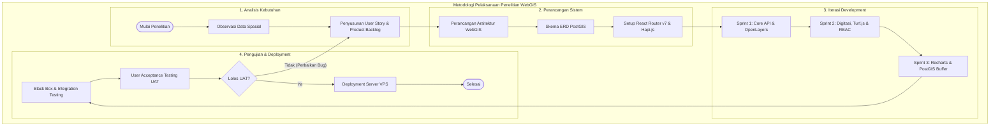

# BAB III METODOLOGI PENELITIAN

## 3.1 Judul Penelitian & Framework Pengembangan
Penelitian ini berfokus pada **"Pengembangan WebGIS Monitoring Realisasi Infrastruktur dan Pengolahan Data Spasial Menggunakan React Router, OpenLayers, Turf.js, dan PostGIS"**. 

Pengembangan aplikasi menerapkan metode **Agile** dengan kerangka kerja **Scrum**. Metode ini dipilih karena memungkinkan pengembangan dilakukan secara iteratif, fleksibel terhadap perubahan kebutuhan monitoring infrastruktur, dan menghasilkan modul-modul fungsional (*increment*) secara cepat melalui rangkaian *sprint*.

---

## 3.2 Tahapan Pengembangan Aplikasi (Agile / Scrum Framework)

Rincian tahapan pengembangan aplikasi WebGIS berdasarkan kerangka kerja *Scrum* serta penerapan spesifik *tech stack* proyek (*React Router v7, TypeScript, OpenLayers, Turf.js, Tailwind CSS v4, Hapi.js/Express, dan PostGIS*) disajikan pada **Tabel 3.1** berikut:

### Tabel 3.1 Tahapan Pengembangan Aplikasi WebGIS Monitoring Infrastruktur

| No | Tahapan | Deskripsi Kegiatan (Spesifik Tech Stack Proyek) | Luaran / Output |
| :---: | :--- | :--- | :--- |
| **1** | **Pra-Sprint (*Product Backlog & Architecture Setup*)** | <ul><li>Mengidentifikasi kebutuhan sistem monitoring realisasi infrastruktur, data spasial jalan desa, dan katalog dataset (*User Stories*).</li><li>Merancang arsitektur WebGIS *Decoupled* (Frontend: **React Router v7 + TypeScript**, Backend: **Hapi.js/Express REST API**).</li><li>Merancang skema basis data spasial **PostgreSQL / PostGIS** (Tabel segmen jalan, titik infrastruktur, spasial geometri `LineString` & `Point`, serta data atribut monitoring).</li><li>Menyiapkan *environment* proyek berbasis **Vite**, **Tailwind CSS v4**, **Radix UI**, dan *state management*.</li></ul> | <ul><li>Dokumen *Product Backlog* (*User Stories*)</li><li>Diagram Arsitektur WebGIS & ERD PostGIS</li><li>Skema DDL Spasial Basis Data</li><li>Inisialisasi Project Repository (*React Router v7*)</li></ul> |
| **2** | **Sprint 1: *Core API*, Peta Dasar, & Visualisasi Spasial (*OpenLayers*)** | <ul><li>Membangun *endpoint* REST API pada **Hapi.js/Express** untuk query spasial PostGIS (`ST_AsGeoJSON`, `ST_BBox`).</li><li>Membuat komponen peta dasar interaktif (**React 19**) menggunakan **OpenLayers** (`ol/Map`, `ol/View`, `ol/layer/Tile`, `ol/source/OSM`).</li><li>Mengintegrasikan *Vector Layer* OpenLayers (`ol/layer/Vector`) untuk merender layer spasial infrastruktur dan batas wilayah.</li><li>Mengimplementasikan fitur *Layer Switcher* dan *Zoom Control* kustom dengan styling **Tailwind CSS v4** dan **Lucide Icons**.</li></ul> | <ul><li>REST API Endpoint Spasial (Hapi.js/PostGIS)</li><li>Komponen Peta Dasar Interaktif (`MapWorkspaceView`)</li><li>Visualisasi Vector Layer Data Spasial Infrastruktur</li><li>Kontrol Peta dasar & Peta Tematik</li></ul> |
| **3** | **Sprint 2: Digitasi Spasial, Manajemen Data Atribut, & Hak Akses (RBAC)** | <ul><li>Mengimplementasikan modul digitasi dan modifikasi spasial di **OpenLayers** (`ol/interaction/Draw`, `ol/interaction/Modify`, `ol/interaction/Snap`).</li><li>Mengolah dan memvalidasi perhitungan geometri spasial di sisi *client* menggunakan **Turf.js** (`@turf/turf` untuk panjang segmen & luas area).</li><li>Membuat antarmuka input data atribut infrastruktur berbasis **React Hook Form** + **Zod** dan **TanStack Table** untuk *data grid*.</li><li>Mengimplementasikan kontrol hak akses pengguna (*Role-Based Access Control*) menggunakan **CASL** (`@casl/ability`).</li></ul> | <ul><li>Modul Digitasi & Editor Geometri Spasial</li><li>Fitur Kalkulasi Spasial Client-side (Turf.js)</li><li>Form Input & Tabel Data Grid (TanStack Table)</li><li>Sistem Autentikasi & Otorisasi RBAC (CASL)</li></ul> |
| **4** | **Sprint 3: Dashboard Monitoring, Analisis Spasial, & Ekspor Cetak Peta** | <ul><li>Membuat *Dashboard Monitoring Realisasi Infrastruktur* interaktif memanfaatkan **Recharts** untuk grafik statistik dan progres fisik/keuangan.</li><li>Mengembangkan fungsi analisis spasial PostGIS (spasial buffer `ST_Buffer` & pencarian radius `ST_DWithin`).</li><li>Mengintegrasikan fitur ekspor peta spasial dan laporan monitoring ke format PDF/Gambar menggunakan **jsPDF**, **html2canvas**, dan **XLSX**.</li><li>Mengimplementasikan komponen notifikasi (*toast*) menggunakan **Sonner** dan dialog konfirmasi (**Radix UI Alert Dialog**).</li></ul> | <ul><li>Dashboard Monitoring & Grafik Statistik (Recharts)</li><li>Fitur Analisis & Pencarian Spasial Radius</li><li>Modul Cetak & Ekspor Peta/Laporan (PDF & Excel)</li><li>Antarmuka Monitoring Infrastruktur Lengkap</li></ul> |
| **5** | **Sprint Testing & Integrasi System (*Testing & Review*)** | <ul><li>Melakukan pengujian *Black Box Testing* pada seluruh komponen **React Router v7**, navigasi halaman, dan interaksi peta **OpenLayers**.</li><li>Melakukan pengujian *Integration Testing* antara *frontend* React dan *backend REST API* Hapi.js/PostGIS.</li><li>Melakukan validasi topologi geometri spasial (memastikan tidak ada geometri *invalid* atau *self-intersecting*).</li><li>Melaksanakan *Sprint Review* bersama *stakeholder* untuk evaluasi fungsionalitas sistem monitoring.</li></ul> | <ul><li>Dokumen Hasil Pengujian (*Test Report*)</li><li>Matriks Pengujian *Black Box* & Integrasi</li><li>*Bug Tracking Log* & Perbaikan Aplikasi</li><li>Sistem WebGIS Versi Siap Rilis (*Release Candidate*)</li></ul> |
| **6** | **Rilis, Deployment, & Retrospektif (*Deployment & Retrospective*)** | <ul><li>Melakukan optimasi *build production* (**Vite** & React Router Server/Node).</li><li>Mengonfigurasi *Proxy Middleware* (`http-proxy-middleware`) dan *deployment* basis data **PostGIS** serta aplikasi ke Cloud Server / VPS.</li><li>Mengatur *environment variable*, variabel CORS, dan proteksi *endpoint API*.</li><li>Melakukan *Sprint Retrospective* untuk evaluasi proses pengembangan serta dokumentasi teknis sistem.</li></ul> | <ul><li>Aplikasi WebGIS Monitoring Infrastruktur (Live Server)</li><li>Dokumentasi REST API & Skema Data Spasial</li><li>Dokumen Retrospektif & Laporan Akhir Sistem</li></ul> |

Berdasarkan Tabel 3.1 di atas, arsitektur WebGIS dibangun dengan memanfaatkan **React Router v7** dan **OpenLayers** di sisi *frontend* untuk menyajikan peta interaktif dan modul digitasi, **Turf.js** untuk komputasi spasial di sisi klien, **Recharts** untuk grafik dashboard monitoring, **CASL** untuk manajemen hak akses, **Hapi.js/Express** di sisi *backend API*, serta **PostgreSQL/PostGIS** sebagai basis data spasial utama.

---

## 3.3 Jadwal Pelaksanaan Penelitian (Gantt Chart 4 Bulan)

Jadwal pelaksanaan penelitian dan pengembangan aplikasi WebGIS Monitoring Infrastruktur dilaksanakan selama 4 (empat) bulan (16 minggu, dengan asumsi 1 bulan terdiri dari 4 minggu) yang terbagi dalam siklus *Agile Sprint* sebagaimana tercantum dalam **Tabel 3.2** berikut:

### Tabel 3.2 Jadwal Pelaksanaan Penelitian dan Pengembangan Aplikasi (4 Bulan / 16 Minggu)

<table>
  <thead>
    <tr>
      <th rowspan="2" style="text-align: center; width: 4%;">No</th>
      <th rowspan="2" style="text-align: center; width: 32%;">Tahapan Kegiatan</th>
      <th colspan="4" style="text-align: center;">Bulan 1</th>
      <th colspan="4" style="text-align: center;">Bulan 2</th>
      <th colspan="4" style="text-align: center;">Bulan 3</th>
      <th colspan="4" style="text-align: center;">Bulan 4</th>
    </tr>
    <tr>
      <th style="text-align: center; width: 4%;">M1</th>
      <th style="text-align: center; width: 4%;">M2</th>
      <th style="text-align: center; width: 4%;">M3</th>
      <th style="text-align: center; width: 4%;">M4</th>
      <th style="text-align: center; width: 4%;">M1</th>
      <th style="text-align: center; width: 4%;">M2</th>
      <th style="text-align: center; width: 4%;">M3</th>
      <th style="text-align: center; width: 4%;">M4</th>
      <th style="text-align: center; width: 4%;">M1</th>
      <th style="text-align: center; width: 4%;">M2</th>
      <th style="text-align: center; width: 4%;">M3</th>
      <th style="text-align: center; width: 4%;">M4</th>
      <th style="text-align: center; width: 4%;">M1</th>
      <th style="text-align: center; width: 4%;">M2</th>
      <th style="text-align: center; width: 4%;">M3</th>
      <th style="text-align: center; width: 4%;">M4</th>
    </tr>
  </thead>
  <tbody>
    <tr class="section-row">
      <td style="text-align: center;"><strong>1</strong></td>
      <td colspan="17"><strong>Analisis Kebutuhan</strong></td>
    </tr>
    <tr>
      <td style="text-align: center;">1.1</td>
      <td>Observasi data spasial infrastruktur & studi literatur</td>
      <td style="text-align: center;">■</td><td style="text-align: center;">■</td><td></td><td></td>
      <td></td><td></td><td></td><td></td>
      <td></td><td></td><td></td><td></td>
      <td></td><td></td><td></td><td></td>
    </tr>
    <tr>
      <td style="text-align: center;">1.2</td>
      <td>Penyusunan <em>User Story</em> & <em>Product Backlog</em> WebGIS</td>
      <td></td><td style="text-align: center;">■</td><td style="text-align: center;">■</td><td></td>
      <td></td><td></td><td></td><td></td>
      <td></td><td></td><td></td><td></td>
      <td></td><td></td><td></td><td></td>
    </tr>
    <tr class="section-row">
      <td style="text-align: center;"><strong>2</strong></td>
      <td colspan="17"><strong>Perancangan Sistem & UI/UX</strong></td>
    </tr>
    <tr>
      <td style="text-align: center;">2.1</td>
      <td>Perancangan arsitektur WebGIS & ERD PostGIS</td>
      <td></td><td style="text-align: center;">■</td><td style="text-align: center;">■</td><td></td>
      <td></td><td></td><td></td><td></td>
      <td></td><td></td><td></td><td></td>
      <td></td><td></td><td></td><td></td>
    </tr>
    <tr>
      <td style="text-align: center;">2.2</td>
      <td>Desain antarmuka UI/UX (Tailwind v4 & Radix UI)</td>
      <td></td><td></td><td style="text-align: center;">■</td><td style="text-align: center;">■</td>
      <td></td><td></td><td></td><td></td>
      <td></td><td></td><td></td><td></td>
      <td></td><td></td><td></td><td></td>
    </tr>
    <tr>
      <td style="text-align: center;">2.3</td>
      <td>Perancangan RESTful API Endpoint Hapi.js</td>
      <td></td><td></td><td></td><td style="text-align: center;">■</td>
      <td></td><td></td><td></td><td></td>
      <td></td><td></td><td></td><td></td>
      <td></td><td></td><td></td><td></td>
    </tr>
    <tr class="section-row">
      <td style="text-align: center;"><strong>3</strong></td>
      <td colspan="17"><strong>Implementasi & Pengkodean</strong></td>
    </tr>
    <tr>
      <td style="text-align: center;">3.1</td>
      <td>Setup <em>environment</em> (React Router v7, OpenLayers, PostGIS)</td>
      <td></td><td></td><td></td><td style="text-align: center;">■</td>
      <td style="text-align: center;">■</td><td></td><td></td><td></td>
      <td></td><td></td><td></td><td></td>
      <td></td><td></td><td></td><td></td>
    </tr>
    <tr>
      <td style="text-align: center;">3.2</td>
      <td>Pengembangan Backend API Hapi.js & Query PostGIS</td>
      <td></td><td></td><td></td><td></td>
      <td style="text-align: center;">■</td><td style="text-align: center;">■</td><td style="text-align: center;">■</td><td></td>
      <td></td><td></td><td></td><td></td>
      <td></td><td></td><td></td><td></td>
    </tr>
    <tr>
      <td style="text-align: center;">3.3</td>
      <td>Pengembangan Peta Dasar OpenLayers & Client State</td>
      <td></td><td></td><td></td><td></td>
      <td></td><td style="text-align: center;">■</td><td style="text-align: center;">■</td><td style="text-align: center;">■</td>
      <td style="text-align: center;">■</td><td></td><td></td><td></td>
      <td></td><td></td><td></td><td></td>
    </tr>
    <tr>
      <td style="text-align: center;">3.4</td>
      <td>Fitur Digitasi (Turf.js), Dashboard Recharts, & CASL RBAC</td>
      <td></td><td></td><td></td><td></td>
      <td></td><td></td><td></td><td style="text-align: center;">■</td>
      <td style="text-align: center;">■</td><td style="text-align: center;">■</td><td></td><td></td>
      <td></td><td></td><td></td><td></td>
    </tr>
    <tr class="section-row">
      <td style="text-align: center;"><strong>4</strong></td>
      <td colspan="17"><strong>Pengujian Aplikasi</strong></td>
    </tr>
    <tr>
      <td style="text-align: center;">4.1</td>
      <td>Pengujian <em>Black Box Testing</em> (UI React Router & Map)</td>
      <td></td><td></td><td></td><td></td>
      <td></td><td></td><td></td><td></td>
      <td></td><td></td><td style="text-align: center;">■</td><td style="text-align: center;">■</td>
      <td></td><td></td><td></td><td></td>
    </tr>
    <tr>
      <td style="text-align: center;">4.2</td>
      <td>Pengujian Integration & API Spasial Testing</td>
      <td></td><td></td><td></td><td></td>
      <td></td><td></td><td></td><td></td>
      <td></td><td></td><td></td><td style="text-align: center;">■</td>
      <td style="text-align: center;">■</td><td></td><td></td><td></td>
    </tr>
    <tr>
      <td style="text-align: center;">4.3</td>
      <td>Pengujian <em>User Acceptance Testing</em> (UAT) Monitoring</td>
      <td></td><td></td><td></td><td></td>
      <td></td><td></td><td></td><td></td>
      <td></td><td></td><td></td><td></td>
      <td style="text-align: center;">■</td><td style="text-align: center;">■</td><td></td><td></td>
    </tr>
    <tr class="section-row">
      <td style="text-align: center;"><strong>5</strong></td>
      <td colspan="17"><strong>Deployment & Penyusunan Laporan</strong></td>
    </tr>
    <tr>
      <td style="text-align: center;">5.1</td>
      <td><em>Deployment</em> WebGIS ke Cloud Server / VPS</td>
      <td></td><td></td><td></td><td></td>
      <td></td><td></td><td></td><td></td>
      <td></td><td></td><td></td><td></td>
      <td></td><td style="text-align: center;">■</td><td style="text-align: center;">■</td><td></td>
    </tr>
    <tr>
      <td style="text-align: center;">5.2</td>
      <td>Penyusunan & finalisasi dokumen laporan penelitian</td>
      <td style="text-align: center;">■</td><td style="text-align: center;">■</td><td style="text-align: center;">■</td><td style="text-align: center;">■</td>
      <td style="text-align: center;">■</td><td style="text-align: center;">■</td><td style="text-align: center;">■</td><td style="text-align: center;">■</td>
      <td style="text-align: center;">■</td><td style="text-align: center;">■</td><td style="text-align: center;">■</td><td style="text-align: center;">■</td>
      <td style="text-align: center;">■</td><td style="text-align: center;">■</td><td style="text-align: center;">■</td><td style="text-align: center;">■</td>
    </tr>
  </tbody>
</table>

---

## 3.4 Penjabaran Jadwal Pelaksanaan Penelitian

Berikut adalah rincian penjelasan dari setiap sub-tahapan kegiatan pengembangan aplikasi WebGIS Monitoring Realisasi Infrastruktur berdasarkan **Tabel 3.2**:

### 1. Tahap Analisis Kebutuhan
* **1.1 Observasi Data Spasial Infrastruktur & Studi Literatur (Bulan 1: Minggu 1 – Minggu 2)**  
  Mengumpulkan referensi pustaka mengenai konsep sistem informasi geografis berbasis web, standar data spasial jalan desa dan infrastruktur, serta menganalisis kebutuhan format geometri spasial (`LineString` dan `Point`). Pada kegiatan ini dilakukan pula kajian teknis terhadap pustaka OpenLayers, Turf.js, dan PostGIS.
* **1.2 Penyusunan *User Story* & *Product Backlog* WebGIS (Bulan 1: Minggu 2 – Minggu 3)**  
  Mengidentifikasi seluruh alur pengguna (administrator, staf monitoring, dan publik) serta menyusunnya ke dalam *Product Backlog*. Kebutuhan fungsional dipetakan menjadi unit-unit *user story* seperti visualisasi layer peta dasar, digitasi segmen jalan, filter atribut, dashboard monitoring, serta kontrol akses pengguna.

### 2. Tahap Perancangan Sistem & UI/UX
* **2.1 Perancangan Arsitektur WebGIS & ERD PostGIS (Bulan 1: Minggu 2 – Minggu 3)**  
  Merancang arsitektur sistem terpisah (*decoupled architecture*) yang menghubungkan aplikasi *frontend* berbasis React Router v7 dengan *backend REST API* Hapi.js. Pada tahap ini dirancang pula skema *Entity Relationship Diagram* (ERD) dan struktur tabel spasial PostgreSQL/PostGIS untuk menyimpan koordinat geometri spasial beserta data atribut realisasi fisik dan keuangan infrastruktur.
* **2.2 Desain Antarmuka UI/UX (Bulan 1: Minggu 3 – Minggu 4)**  
  Merancang *wireframe* dan prototipe antarmuka sistem menggunakan prinsip desain modern berbasis Tailwind CSS v4 dan Radix UI Primitives. Perancangan difokuskan pada *layout workspace* peta interaktif (`MapWorkspaceView`), panel navigasi sidebar, tabel data grid monitoring, dan dialog konfirmasi.
* **2.3 Perancangan RESTful API Endpoint Hapi.js (Bulan 1: Minggu 4)**  
  Merancang spesifikasi *endpoint* REST API mencakup struktur *request payload*, *response GeoJSON*, format status HTTP, serta query spasial PostGIS yang akan dipanggil oleh *frontend* (seperti `ST_AsGeoJSON` dan `ST_GeomFromGeoJSON`).

### 3. Tahap Implementasi & Pengkodean
* **3.1 Setup *Environment* Pengembangan (Bulan 1: Minggu 4 – Bulan 2: Minggu 1)**  
  Menyiapkan repositori kode (*React Router v7 + TypeScript*), mengonfigurasi *bundler* Vite, memasang pustaka pendukung seperti OpenLayers (`ol`), Turf.js (`@turf/turf`), Tailwind CSS v4, Radix UI, TanStack Table, Recharts, dan CASL, serta melakukan inisialisasi basis data PostgreSQL dengan ekstensi PostGIS.
* **3.2 Pengembangan Backend API Hapi.js & Query PostGIS (Bulan 2: Minggu 1 – Minggu 3)**  
  Mengimplementasikan *handler* dan *route* API pada Hapi.js/Express untuk melayani permintaan data spasial, operasi CRUD data infrastruktur, serta mengeksekusi query fungsi spasial ke basis data PostGIS.
* **3.3 Pengembangan Peta Dasar OpenLayers & Client State (Bulan 2: Minggu 2 – Bulan 3: Minggu 1)**  
  Membangun komponen peta interaktif menggunakan OpenLayers di sisi React.js. Kegiatan meliputi integrasi layer dasar (*OpenStreetMap/Tile layer*), rendering *Vector Layer* untuk data spasial infrastruktur, pembuatan kontrol *Layer Switcher*, *Zoom Control*, serta penanganan *state management* peta.
* **3.4 Fitur Digitasi (Turf.js), Dashboard Recharts, & CASL RBAC (Bulan 2: Minggu 4 – Bulan 3: Minggu 2)**  
  Mengembangkan fitur interaktif seperti alat digitasi spasial (`ol/interaction/Draw` dan `Modify`), validasi geometri spasial client-side menggunakan Turf.js, visualisasi grafik progres realisasi infrastruktur menggunakan Recharts, serta penerapan pembatasan hak akses berbasis peran pengguna (*Role-Based Access Control*) menggunakan CASL (`@casl/ability`).

### 4. Tahap Pengujian Aplikasi
* **4.1 Pengujian *Black Box Testing* (Bulan 3: Minggu 3 – Minggu 4)**  
  Melakukan pengujian fungsionalitas antarmuka React Router, interaksi peta OpenLayers, tombol navigasi, form masukan data, dan respon tampilan tanpa melihat struktur kode internal untuk memastikan aplikasi berjalan bebas dari kesalahan logika tampilan.
* **4.2 Pengujian Integration & API Spasial Testing (Bulan 3: Minggu 4 – Bulan 4: Minggu 1)**  
  Menguji komunikasi data antara *frontend* React dan *backend REST API* Hapi.js/PostGIS, menguji performa pengiriman payload GeoJSON, serta memastikan validitas query spasial saat menangani koordinat spasial kompleks.
* **4.3 Pengujian *User Acceptance Testing* / UAT (Bulan 4: Minggu 1 – Minggu 2)**  
  Melakukan pengujian penerimaan pengguna (*UAT*) bersama pihak pengelola data infrastruktur dan calon pengguna untuk mengevaluasi kesesuaian sistem dengan alur kerja operasional di lapangan.

### 5. Tahap Deployment & Penyusunan Laporan
* **5.1 *Deployment* WebGIS ke Cloud Server / VPS (Bulan 4: Minggu 2 – Minggu 3)**  
  Melakukan proses *build production* pada React Router v7 & Vite, mengonfigurasi *proxy middleware*, memasang aplikasi dan basis data PostGIS pada server (*VPS / Cloud Infrastructure*), serta mengatur sertifikat SSL dan proteksi keamanan sistem.
* **5.2 Penyusunan & Finalisasi Dokumen Laporan Penelitian (Bulan 1: Minggu 1 – Bulan 4: Minggu 4)**  
  Menyusun dokumentasi teknis, catatan hasil pengujian, dan menyempurnakan seluruh bab laporan hasil penelitian secara bertahap dan berkesinambungan dari awal hingga akhir siklus pengembangan.

---

## 3.5 Flowchart Pelaksanaan Penelitian dan Pengembangan Aplikasi

Berikut adalah diagram alir (*flowchart*) metodologi pelaksanaan penelitian dan pengembangan aplikasi WebGIS Monitoring Infrastruktur berbasis kerangka kerja **Agile / Scrum** dengan tata letak matriks 2D (**Kesamping untuk Tahap Utama & Kebawah untuk Sub-langkah**):

### Penjelasan Alur Flowchart Pelaksanaan Penelitian:

1. **Tahap 1: Analisis Kebutuhan (Kolom 1 - Vertical)**:  
   Penelitian diawali dari simpul `Mulai Penelitian`, dilanjutkan dengan observasi data spasial infrastruktur, dan penyusunan *User Story / Product Backlog*.
2. **Tahap 2: Perancangan Sistem (Kolom 2 - Vertical)**:  
   Dari *Product Backlog*, alur berpindah **kesamping** ke perancangan arsitektur *decoupled*, skema ERD PostGIS, dan pengesetup *environment* proyek React Router v7 & Hapi.js.
3. **Tahap 3: Iterasi Development (Kolom 3 - Vertical)**:  
   Alur berpindah **kesamping** mengeksekusi *Sprint 1* (API & Peta Dasar OpenLayers), dilanjutkan ke bawah ke *Sprint 2* (Digitasi Turf.js & CASL RBAC), dan *Sprint 3* (Dashboard Recharts & Buffer PostGIS).
4. **Tahap 4: Pengujian & Deployment (Kolom 4 - Vertical)**:  
   Alur berpindah **kesamping** mengeksekusi *Black Box & Integration Testing*, *User Acceptance Testing (UAT)*, dan evaluasi kelayakan sistem. Apabila tidak lolos (`Tidak`), alur berulang kembali ke perbaikan *User Story*. Apabila lolos (`Ya`), sistem di-*deploy* ke VPS/Cloud Server hingga simpul `Selesai`.
