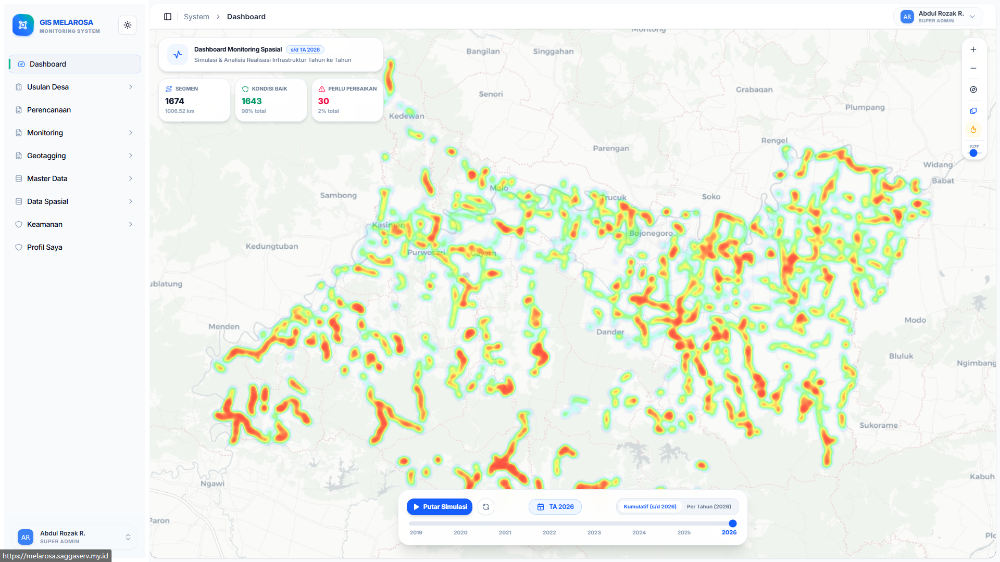
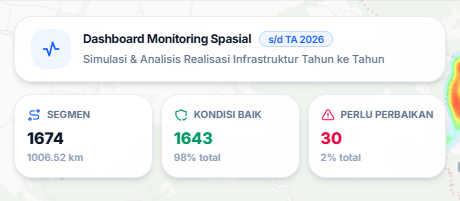
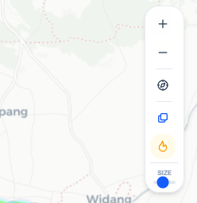
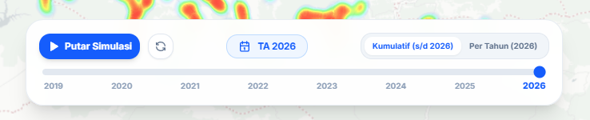
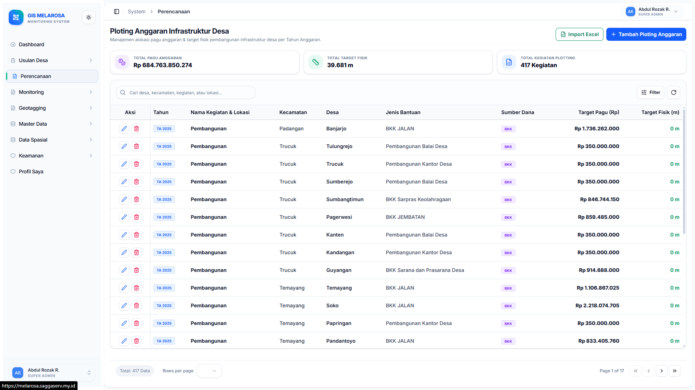
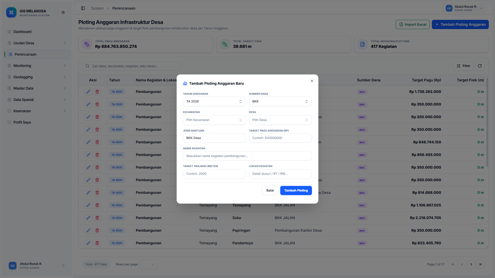

# PANDUAN PENGGUNA

# MELAROSA 2.0

**Monitoring Layanan dan Realisasi Infrastruktur Berbasis Spasial**

**Bappeda Kabupaten Bojonegoro**

**Versi 1.0**

**11 Agustus 2026**

---

# DAFTAR ISI

- [DAFTAR ISI](#daftar-isi)
- [DAFTAR GAMBAR](#daftar-gambar)
- [DAFTAR TABEL](#daftar-tabel)
- [BAB 1 REGISTRASI PENGGUNA](#bab-1-registrasi-pengguna)
  - [1.1 Deskripsi](#11-deskripsi)
  - [1.2 Hak Akses](#12-hak-akses)
  - [1.3 Komponen Antarmuka](#13-komponen-antarmuka)
  - [1.4 Langkah Pengoperasian](#14-langkah-pengoperasian)
    - [1.4.1 Mengajukan Registrasi Akun Operator Baru](#141-mengajukan-registrasi-akun-operator-baru)
- [BAB 2 MASUK KE SISTEM (LOGIN)](#bab-2-masuk-ke-sistem-login)
  - [2.1 Deskripsi](#21-deskripsi)
  - [2.2 Hak Akses](#22-hak-akses)
  - [2.3 Komponen Antarmuka](#23-komponen-antarmuka)
  - [2.4 Langkah Pengoperasian](#24-langkah-pengoperasian)
    - [2.4.1 Masuk ke Dalam Sistem](#241-masuk-ke-dalam-sistem)
- [BAB 3 DASHBOARD UTAMA](#bab-3-dashboard-utama)
  - [3.1 Deskripsi](#31-deskripsi)
  - [3.2 Hak Akses](#32-hak-akses)
  - [3.3 Komponen Antarmuka](#33-komponen-antarmuka)
    - [3.3.1 Panel Ringkasan Statistik](#331-panel-ringkasan-statistik)
    - [3.3.2 Panel Kontrol Peta](#332-panel-kontrol-peta)
    - [3.3.3 Panel Time Slider](#333-panel-time-slider)
  - [3.4 Langkah Pengoperasian](#34-langkah-pengoperasian)
    - [3.4.1 Menjalankan Simulasi Tahun ke Tahun](#341-menjalankan-simulasi-tahun-ke-tahun)
    - [3.4.2 Mengubah Mode Visualisasi](#342-mengubah-mode-visualisasi)
    - [3.4.3 Mengganti Peta Dasar](#343-mengganti-peta-dasar)
- [BAB 4 PLOTING ANGGARAN](#bab-4-ploting-anggaran)
  - [4.1 Deskripsi](#41-deskripsi)
  - [4.2 Hak Akses](#42-hak-akses)
  - [4.3 Komponen Antarmuka](#43-komponen-antarmuka)
    - [4.3.1 Panel Ringkasan Statistik Anggaran](#431-panel-ringkasan-statistik-anggaran)
    - [4.3.2 Toolbar Pencarian dan Filter Popover](#432-toolbar-pencarian-dan-filter-popover)
    - [4.3.3 Tabel Data Ploting Anggaran](#433-tabel-data-ploting-anggaran)
  - [4.4 Langkah Pengoperasian](#44-langkah-pengoperasian)
    - [4.4.1 Menambahkan Data Ploting Anggaran Baru](#441-menambahkan-data-ploting-anggaran-baru)
    - [4.4.2 Mengubah Data Ploting Anggaran](#442-mengubah-data-ploting-anggaran)
    - [4.4.3 Mengimpor Data Ploting Anggaran dari Excel](#443-mengimpor-data-ploting-anggaran-dari-excel)
- [BAB 5 GEOTAGGING](#bab-5-geotagging)
  - [5.1 Deskripsi](#51-deskripsi)
  - [5.2 Hak Akses](#52-hak-akses)
  - [5.3 Komponen Antarmuka](#53-komponen-antarmuka)
    - [5.3.1 Form Realisasi](#531-form-realisasi)
    - [5.3.2 Input & Verifikasi Realisasi](#532-input--verifikasi-realisasi)
  - [5.4 Langkah Pengoperasian](#54-langkah-pengoperasian)
    - [5.4.1 Mengelola Form Realisasi](#541-mengelola-form-realisasi)
    - [5.4.2 Menginput dan Memverifikasi Data Geotagging Realisasi](#542-menginput-dan-memverifikasi-data-geotagging-realisasi)

---

# DAFTAR GAMBAR

*Gambar 1-1. Tampilan Halaman Registrasi Akun Operator*
*Gambar 1-2. Tampilan Notifikasi Pengajuan Berhasil Menunggu Persetujuan Admin*
*Gambar 2-1. Tampilan Halaman Masuk ke Sistem (Login)*
*Gambar 3-1. Tampilan Utama Halaman Dashboard*
*Gambar 3-2. Panel Ringkasan Statistik Kondisi Jalan*
*Gambar 3-3. Panel Kontrol Peta dan Mode Visualisasi*
*Gambar 3-4. Panel Time Slider dan Kontrol Simulasi*
*Gambar 4-1. Tampilan Utama Halaman Ploting Anggaran*
*Gambar 4-2. Formulir Input Ploting Anggaran Infrastruktur*
*Gambar 5-1. Tampilan Manajemen Form Realisasi*
*Gambar 5-2. Tampilan Input & Verifikasi Data Geotagging Realisasi*

---

# DAFTAR TABEL

*Tabel 1-1. Matriks Hak Akses Pengajuan Registrasi Akun*
*Tabel 1-2. Keterangan Formulir Registrasi Akun Operator*
*Tabel 2-1. Keterangan Formulir Masuk ke Sistem (Login)*
*Tabel 3-1. Matriks Hak Akses Pengguna Dashboard*
*Tabel 3-2. Klasifikasi Warna Garis Vektor Kondisi Jalan*
*Tabel 4-1. Matriks Hak Akses Pengguna Ploting Anggaran*
*Tabel 4-2. Ringkasan Fitur Formulir Ploting Anggaran*
*Tabel 5-1. Matriks Hak Akses Pengguna Modul Geotagging*
*Tabel 5-2. Keterangan Komponen Form Realisasi*
*Tabel 5-3. Keterangan Element Input & Verifikasi Realisasi*
*Tabel 5-4. Matriks Status Verifikasi Data Realisasi*

---

## BAB 1 REGISTRASI PENGGUNA

### 1.1 Deskripsi

Halaman Registrasi Pengguna (`/register`) merupakan fasilitas pendaftaran akun baru bagi calon Operator Desa dan Operator Kecamatan pada aplikasi MELAROSA 2.0.

Melalui halaman ini (`/register`), calon pengguna dapat:
* mengajukan pendaftaran akun resmi operator wilayah;
* memilih peran (role) tugas sebagai Operator Desa atau Operator Kecamatan;
* menentukan lokasi wilayah kerja kecamatan dan desa yang dikelola;
* mengirimkan data permohonan ke Administrator Bappeda untuk proses verifikasi dan persetujuan.

*Gambar 1-1. Tampilan Halaman Registrasi Akun Operator*

> **Catatan**
>
> Akun yang telah terdaftar memerlukan verifikasi dan persetujuan dari Administrator Bappeda Kabupaten Bojonegoro sebelum dapat digunakan untuk masuk ke dalam sistem.

---

### 1.2 Hak Akses

Fasilitas registrasi akun pada route (`/register`) terbuka untuk calon petugas operator wilayah kerja Kabupaten Bojonegoro dengan ketentuan permohonan sebagai berikut:

| Peran | Hak Akses Registrasi (`/register`) |
|---|---|
| Operator Desa | Dapat mengajukan akun baru dengan memilih lokasi Kecamatan dan Desa wilayah kerja |
| Operator Kecamatan | Dapat mengajukan akun baru dengan memilih lokasi Kecamatan wilayah kerja |

*Tabel 1-1. Matriks Hak Akses Pengajuan Registrasi Akun*

---

### 1.3 Komponen Antarmuka

Halaman Registrasi Pengguna (`/register`) terdiri dari komponen formulir pengisian data permohonan akun:

| No | Komponen / Field | Fungsi |
|---:|---|---|
| 1 | Nama Lengkap | Menginput nama lengkap calon pengguna |
| 2 | Alamat Email | Menginput email aktif yang digunakan sebagai identitas masuk sistem |
| 3 | Password | Menginput kata sandi keamanan akun (minimal 6 karakter) |
| 4 | Peran (Role) Operator | Memilih kategori tugas: Operator Desa atau Operator Kecamatan |
| 5 | Kecamatan Wilayah Kerja | Memilih wilayah kecamatan tugas dari daftar dropdown |
| 6 | Desa Wilayah Kerja | Memilih wilayah desa tugas (wajib diisi khusus untuk Operator Desa) |
| 7 | Tombol Kirim Pengajuan | Mengirimkan formulir permohonan pendaftaran ke sistem |

*Tabel 1-2. Keterangan Formulir Registrasi Akun Operator*

*Gambar 1-2. Tampilan Notifikasi Pengajuan Berhasil Menunggu Persetujuan Admin*

---

### 1.4 Langkah Pengoperasian

#### 1.4.1 Mengajukan Registrasi Akun Operator Baru

Berikut adalah langkah-langkah untuk mengajukan pendaftaran akun operator baru:

1. Akses halaman pendaftaran akun melalui route (`/register`) atau tombol **Daftar Akun** pada halaman login.
2. Masukkan **Nama Lengkap** Anda.
3. Masukkan **Alamat Email** aktif.
4. Masukkan **Password** keamanan akun.
5. Pilih **Peran (Role) Operator** (`Operator Desa` atau `Operator Kecamatan`).
6. Pilih **Kecamatan Wilayah Kerja** dari daftar pilihan.
7. Jika memilih Operator Desa, pilih **Desa Wilayah Kerja** yang dikelola.
8. Klik tombol **Kirim Pengajuan Registrasi**.
9. Sistem menampilkan notifikasi bahwa pendaftaran berhasil dikirim dan berada dalam status menunggu verifikasi Administrator Bappeda.

---

## BAB 2 MASUK KE SISTEM (LOGIN)

### 2.1 Deskripsi

Halaman Masuk ke Sistem (`/login`) merupakan gerbang utama untuk mengautentikasi dan mengamankan akses pengguna terdaftar pada aplikasi MELAROSA 2.0.

Melalui halaman ini (`/login`), pengguna dapat:
* menginput kredensial akun berupa email dan password yang terdaftar;
* masuk ke dalam portal administratif WebGIS MELAROSA 2.0;
* mengakses fitur dan data spasial sesuai hak akses peran yang dimiliki.

*Gambar 2-1. Tampilan Halaman Masuk ke Sistem (Login)*

> **Catatan**
>
> Pastikan email dan password yang dimasukkan sudah terverifikasi dan aktif. Gunakan tombol Lupa Password apabila mengalami kendala akses.

---

### 2.2 Hak Akses

Halaman Login (`/login`) dapat diakses oleh seluruh pengguna yang telah memiliki akun terdaftar dan aktif dalam sistem, meliputi:
* **Super Admin**
* **Operator Bappeda**
* **Operator Kecamatan**
* **Operator Desa**

---

### 2.3 Komponen Antarmuka

Halaman Login (`/login`) terdiri dari formulir autentikasi pengguna:

| No | Komponen / Field | Fungsi |
|---:|---|---|
| 1 | Alamat Email | Menginput alamat email terdaftar |
| 2 | Password | Menginput kata sandi akun |
| 3 | Tombol Tampilkan Password | Menampilkan atau menyembunyikan karakter kata sandi (ikon mata) |
| 4 | Link Lupa Password | Mengakses fasilitas pemulihan kata sandi akun |
| 5 | Tombol Masuk ke MELAROSA | Memverifikasi kredensial dan mengalihkan pengguna ke Dashboard |
| 6 | Link Daftar Akun | Mengalihkan calon operator desa/kecamatan ke halaman Registrasi (`/register`) |

*Tabel 2-1. Keterangan Formulir Masuk ke Sistem (Login)*

---

### 2.4 Langkah Pengoperasian

#### 2.4.1 Masuk ke Dalam Sistem

Berikut adalah langkah-langkah untuk masuk ke dalam aplikasi:

1. Buka halaman utama aplikasi MELAROSA 2.0 melalui route (`/login`).
2. Masukkan **Alamat Email** yang telah terdaftar.
3. Masukkan **Password** akun Anda.
4. Klik tombol **Masuk ke MELAROSA**.
5. Sistem memverifikasi kredensial akun dan mengalihkan tampilan secara otomatis ke **Dashboard Utama** (`/admin/dashboard`).

---

## BAB 3 DASHBOARD UTAMA

### 3.1 Deskripsi

Halaman Dashboard Utama (`/admin/dashboard`) merupakan halaman pemantauan berbasis peta yang menampilkan gambaran menyeluruh perkembangan realisasi pembangunan infrastruktur jalan di Kabupaten Bojonegoro.

Melalui halaman ini (`/admin/dashboard`), pengguna dapat:
* memantau sebaran segmen jalan;
* mengamati perubahan kondisi dari tahun ke tahun;
* melihat statistik ringkas kondisi fisik jalan;
* menjalankan simulasi perkembangan pembangunan;
* mengganti tahun yang ditampilkan;
* mengganti mode visualisasi;
* mengganti peta dasar.

*Gambar 3-1. Tampilan Utama Halaman Dashboard*

> **Catatan**
>
> Data dan tampilan pada Dashboard (`/admin/dashboard`) mengikuti tahun yang dipilih serta hak akses pengguna.

---

### 3.2 Hak Akses

Halaman Dashboard Utama (`/admin/dashboard`) dapat diakses oleh seluruh pengguna yang terdaftar di dalam sistem berdasarkan peran masing-masing. Hak akses pengguna diatur sesuai dengan cakupan wilayah tugas sebagai berikut:

| Peran | Hak Akses (`/admin/dashboard`) |
|---|---|
| Super Admin | Seluruh data wilayah Kabupaten Bojonegoro |
| Operator Bappeda | Pemantauan makro seluruh wilayah |
| Operator Kecamatan | Data wilayah kecamatan masing-masing |
| Operator Desa | Data wilayah desa masing-masing |

*Tabel 3-1. Matriks Hak Akses Pengguna Dashboard*

---

### 3.3 Komponen Antarmuka

Halaman Dashboard Utama (`/admin/dashboard`) terdiri dari tiga komponen utama yang berada di atas kanvas peta interaktif.

#### 3.3.1 Panel Ringkasan Statistik

Panel Ringkasan Statistik berada di pojok kiri atas peta. Panel ini menyediakan indikator data yang diperbarui secara otomatis berdasarkan filter tahun yang dipilih.

Indikator yang ditampilkan meliputi:
* jumlah total segmen jalan;
* total panjang jalan dalam kilometer;
* jumlah segmen dengan kondisi baik;
* jumlah segmen yang memerlukan perbaikan.

*Gambar 3-2. Panel Ringkasan Statistik Kondisi Jalan*

#### 3.3.2 Panel Kontrol Peta

Panel Kontrol Peta berada di pojok kanan atas peta. Panel ini menyediakan fungsi navigasi dan pengaturan visualisasi peta, meliputi:
* **Zoom In**: Memperbesar tampilan peta.
* **Zoom Out**: Memperkecil tampilan peta.
* **Reset Tampilan**: Mengembalikan orientasi dan cakupan tampilan peta ke kondisi awal.
* **Ganti Peta Dasar**: Mengubah latar belakang peta interaktif.
* **Mode Visualisasi**: Mengubah metode tampilan data spasial.

Mode visualisasi terdiri dari:

1. **Mode Heatmap**  
   Menampilkan kepadatan wilayah pembangunan menggunakan visualisasi peta panas. Pada mode Heatmap terdapat kontrol **Size** untuk mengatur ukuran area pendaran.

2. **Mode Garis Vektor**  
   Menampilkan jalur fisik segmen jalan dengan indikator kondisi jalan berdasarkan klasifikasi warna berikut:

| Warna | Kondisi |
|---|---|
| Hijau | Baik |
| Kuning | Rusak Ringan |
| Merah | Rusak Berat |

*Tabel 3-2. Klasifikasi Warna Garis Vektor Kondisi Jalan*

*Gambar 3-3. Panel Kontrol Peta dan Mode Visualisasi*

#### 3.3.3 Panel Time Slider

Panel Time Slider berada di bagian bawah tengah layar. Panel ini berfungsi untuk:
* memilih tahun anggaran;
* berpindah ke tahun tertentu;
* menjalankan simulasi perkembangan pembangunan;
* menjeda simulasi;
* mereset simulasi.

Rentang simulasi yang tersedia adalah Tahun Anggaran **2020–2026**.

*Gambar 3-4. Panel Time Slider dan Kontrol Simulasi*

---

### 3.4 Langkah Pengoperasian

#### 3.4.1 Menjalankan Simulasi Tahun ke Tahun

Berikut adalah langkah-langkah untuk menjalankan simulasi perkembangan pembangunan:

1. Buka halaman Dashboard Utama melalui menu navigasi (`/admin/dashboard`).
2. Pada panel bawah layar, klik tombol **Putar Simulasi**.
3. Sistem menampilkan perubahan sebaran jalan dari Tahun Anggaran 2020 hingga 2026.
4. Klik tombol **Jeda** untuk menghentikan simulasi.
5. Geser slider secara manual atau klik angka tahun untuk memilih tahun tertentu.
6. Klik **Reset** untuk kembali ke tahun awal.

#### 3.4.2 Mengubah Mode Visualisasi

Berikut adalah langkah-langkah untuk mengubah mode visualisasi peta:

1. Pada panel kontrol peta di kanan atas (`/admin/dashboard`), klik **Mode Visualisasi**.
2. Pilih mode **Heatmap** atau **Garis Vektor**.
3. Jika menggunakan Heatmap, gunakan slider **Size** untuk menyesuaikan ukuran area pendaran.
4. Jika menggunakan Garis Vektor, gunakan warna garis sebagai indikator kondisi jalan.

#### 3.4.3 Mengganti Peta Dasar

Berikut adalah langkah-langkah untuk mengganti peta dasar:

1. Klik tombol **Ganti Peta Dasar** pada panel peta (`/admin/dashboard`).
2. Pilih peta dasar yang tersedia.
3. Sistem memperbarui tampilan peta.

Peta dasar yang tersedia:
* Carto Light;
* Carto Dark;
* OpenStreetMap.

---

## BAB 4 PLOTING ANGGARAN

### 4.1 Deskripsi

Halaman Ploting Anggaran (`/admin/planning/ploting-anggaran`) merupakan fasilitas pengelolaan alokasi pagu anggaran dan target fisik pembangunan infrastruktur desa per Tahun Anggaran pada aplikasi MELAROSA 2.0.

Melalui halaman ini (`/admin/planning/ploting-anggaran`), pengguna dapat:
* mengelola alokasi pagu anggaran kegiatan fisik desa;
* menetapkan target volume fisik (panjang jalan dalam meter);
* memantau rekapitulasi total pagu anggaran dan target fisik;
* memfilter data berdasarkan tahun, kecamatan, desa, dan sumber dana;
* melakukan pencarian kegiatan fisik;
* mengimpor dan mengekspor data alokasi melalui file Excel.

*Gambar 4-1. Tampilan Utama Halaman Ploting Anggaran*

> **Catatan**
>
> Data dan tampilan alokasi anggaran yang ditampilkan menyesuaikan Tahun Anggaran yang dipilih serta hak akses wilayah pengguna.

---

### 4.2 Hak Akses

Halaman Ploting Anggaran (`/admin/planning/ploting-anggaran`) dapat diakses oleh pengguna terdaftar berdasarkan peran dan kewenangan wilayah sebagai berikut:

| Peran | Hak Akses (`/admin/planning/ploting-anggaran`) |
|---|---|
| Super Admin | Seluruh data alokasi anggaran wilayah Kabupaten Bojonegoro |
| Operator Bappeda | Pengelolaan dan pemantauan alokasi anggaran seluruh wilayah |
| Operator Kecamatan | Data alokasi anggaran wilayah kecamatan masing-masing |
| Operator Desa | Data alokasi anggaran wilayah desa masing-masing |

*Tabel 4-1. Matriks Hak Akses Pengguna Ploting Anggaran*

---

### 4.3 Komponen Antarmuka

Halaman Ploting Anggaran (`/admin/planning/ploting-anggaran`) terdiri dari tiga komponen antarmuka utama:

#### 4.3.1 Panel Ringkasan Statistik Anggaran

Panel ringkasan statistik berada di bagian atas halaman dan menampilkan indikator utama:
* **Total Pagu Anggaran**: Jumlah akumulasi pagu anggaran (Rp) dari seluruh kegiatan yang terdaftar.
* **Total Target Fisik**: Akumulasi target panjang penanganan fisik jalan (meter/kilometer).
* **Total Kegiatan Plotting**: Jumlah total paket kegiatan pembangunan yang dialokasikan.

#### 4.3.2 Toolbar Pencarian dan Filter Popover

Toolbar terletak di atas tabel data dan menyediakan fungsi penyaringan:
* **Input Pencarian**: Memfilter data berdasarkan kata kunci nama desa, kecamatan, kegiatan, atau lokasi.
* **Filter Tahun Anggaran**: Menyaring data berdasarkan tahun anggaran (2024–2027).
* **Filter Kecamatan dan Desa**: Menyaring data lokasi administratif.
* **Filter Sumber Dana**: Menyaring alokasi berdasarkan jenis sumber dana (BKK, ADD, DAK, Sektoral, Lainnya).
* **Tombol Import Excel & Export Template**: Mengunduh dan mengunggah berkas data alokasi dalam format spreadsheet.
* **Tombol Tambah Ploting Anggaran**: Membuka dialog formulir penginputan alokasi baru.

#### 4.3.3 Tabel Data Ploting Anggaran

Tabel menampilkan rincian alokasi anggaran dengan kolom data meliputi:
* **Aksi**: Tombol Edit dan Hapus alokasi data.
* **Tahun**: Tahun Anggaran kegiatan.
* **Nama Kegiatan & Lokasi**: Uraian kegiatan dan alamat/posisi fisik pengerjaan.
* **Kecamatan & Desa**: Lokasi wilayah administrasi.
* **Jenis Bantuan & Sumber Dana**: Kategori bantuan keuangan dan asal anggaran.
* **Target Pagu (Rp)**: Besaran nilai alokasi dana.
* **Target Fisik (m)**: Target panjang segmen pengerjaan dalam meter.

*Gambar 4-2. Formulir Input Ploting Anggaran Infrastruktur*

| No | Komponen | Fungsi |
|---:|---|---|
| 1 | Tahun Anggaran | Memilih tahun penetapan alokasi anggaran |
| 2 | Kecamatan & Desa | Memilih lokasi wilayah administratif |
| 3 | Nama & Lokasi Kegiatan | Menginput deskripsi paket pengerjaan fisik |
| 4 | Jenis Bantuan & Sumber Dana | Menentukan kategori skema bantuan keuangan |
| 5 | Target Pagu Anggaran (Rp) | Menginput besaran pagu alokasi dana |
| 6 | Target Panjang (m) | Menginput target fisik pengerjaan |

*Tabel 4-2. Ringkasan Fitur Formulir Ploting Anggaran*

---

### 4.4 Langkah Pengoperasian

#### 4.4.1 Menambahkan Data Ploting Anggaran Baru

Berikut adalah langkah-langkah untuk menambahkan data alokasi anggaran baru:

1. Buka menu **Perencanaan** -> **Ploting Anggaran** (`/admin/planning/ploting-anggaran`).
2. Klik tombol **Tambah Ploting Anggaran** di pojok kanan atas toolbar.
3. Pada dialog yang muncul, pilih **Tahun Anggaran**, **Kecamatan**, dan **Desa**.
4. Masukkan **Nama Kegiatan**, **Lokasi Kegiatan**, **Jenis Bantuan**, dan **Sumber Dana**.
5. Masukkan besaran **Target Pagu Anggaran (Rp)** dan **Target Panjang (m)**.
6. Klik tombol **Simpan**.
7. Sistem menampilkan pesan sukses dan memperbarui tabel data.

#### 4.4.2 Mengubah Data Ploting Anggaran

Berikut adalah langkah-langkah untuk mengubah data alokasi anggaran:

1. Pada tabel data (`/admin/planning/ploting-anggaran`), cari kegiatan yang akan diubah.
2. Klik tombol **Edit** (ikon pensil) pada kolom **Aksi**.
3. Perbarui informasi alokasi anggaran atau target fisik pada formulir.
4. Klik tombol **Simpan**.
5. Sistem memperbarui data alokasi anggaran.

#### 4.4.3 Mengimpor Data Ploting Anggaran dari Excel

Berikut adalah langkah-langkah untuk mengimpor data alokasi dari file Excel:

1. Klik tombol **Import Excel** pada toolbar atas (`/admin/planning/ploting-anggaran`).
2. Klik **Unduh Template** jika belum memiliki format berkas Excel yang sesuai.
3. Isi data alokasi anggaran pada file template Excel.
4. Unggah file Excel melalui dialog import, lalu klik **Proses Import**.
5. Sistem memvalidasi data dan memperbarui daftar alokasi anggaran.

---

## BAB 5 GEOTAGGING

### 5.1 Deskripsi

Halaman Geotagging merupakan modul pengelolaan formulir realisasi serta fasilitas inventarisasi pencatatan data spasial titik lokasi dan verifikasi pengerjaan fisik infrastruktur desa pada aplikasi MELAROSA 2.0.

Modul ini terbagi menjadi dua sub-layanan utama:
1. **Form Realisasi (`/admin/monitoring/form-realisasi`)**: Pengaturan master formulir pelaporan realisasi spasial pembangunan per tahun anggaran, penguncian status periode (Buka/Tutup), serta konfigurasi opsi fungsi dan opsi jenis konstruksi.
2. **Input & Verifikasi Realisasi (`/admin/monitoring/realisasi-entry`)**: Inventarisasi data realisasi fisik, penetapan titik spasial geotagging (koordinat awal/akhir) pada peta interaktif OpenLayers, rincian volume dan anggaran, serta alur persetujuan verifikasi berjenjang.

*Gambar 5-1. Tampilan Manajemen Form Realisasi*

> **Catatan**
>
> Penginputan data geotagging pada menu Input & Verifikasi Realisasi (`/admin/monitoring/realisasi-entry`) hanya dapat dilakukan apabila status Formulir Realisasi untuk Tahun Anggaran berjalan berada dalam posisi Buka (Open).

---

### 5.2 Hak Akses

Kewenangan pengoperasian modul Form Realisasi dan Input & Verifikasi Realisasi diatur berdasarkan peran pengguna sebagai berikut:

| Peran | Hak Akses Form Realisasi (`/admin/monitoring/form-realisasi`) | Hak Akses Input & Verifikasi (`/admin/monitoring/realisasi-entry`) |
|---|---|---|
| Super Admin | Membuat, mengedit, menghapus, serta Membuka/Menutup periode formulir | Input titik spasial, verifikasi akhir tingkat Bappeda, serta penolakan data |
| Operator Bappeda | Mengelola status formulir dan opsi fungsi/konstruksi | Verifikasi persetujuan akhir data realisasi spasial seluruh wilayah |
| Operator Kecamatan | Melihat daftar status formulir realisasi aktif | Verifikasi tingkat kecamatan untuk desa di wilayah kecamatannya |
| Operator Desa | Melihat daftar status formulir realisasi aktif | Input titik koordinat geotagging start/end, volume, dan kirim pengajuan |

*Tabel 5-1. Matriks Hak Akses Pengguna Modul Geotagging*

---

### 5.3 Komponen Antarmuka

#### 5.3.1 Form Realisasi

Halaman Form Realisasi (`/admin/monitoring/form-realisasi`) digunakan oleh pengelola sistem untuk mengonfigurasi formulir pelaporan realisasi dengan komponen utama meliputi:

| No | Komponen / Fitur | Fungsi |
|---:|---|---|
| 1 | Tombol Buat Form Baru | Membuka dialog pembuat formulir pelaporan realisasi baru |
| 2 | Switch Status Buka / Tutup | Mengubah status periode penginputan realisasi (Open/Closed) |
| 3 | Konfigurasi Opsi Fungsi | Mengatur daftar pilihan fungsi infrastruktur (Perdagangan, Kesehatan, Pendidikan, Pertanian, Permukiman) |
| 4 | Konfigurasi Opsi Konstruksi | Mengatur daftar pilihan jenis konstruksi (Aspal/Hotmix, Lapen, Rigid Beton, Paving Block, Telford, Tanah) |
| 5 | Tabel Daftar Form | Menampilkan judul, deskripsi, tahun anggaran, pembuat, serta aksi Edit/Hapus form |

*Tabel 5-2. Keterangan Komponen Form Realisasi*

*Gambar 5-2. Tampilan Input & Verifikasi Data Geotagging Realisasi*

#### 5.3.2 Input & Verifikasi Realisasi

Halaman Input & Verifikasi Realisasi (`/admin/monitoring/realisasi-entry`) menyediakan kanvas peta interaktif OpenLayers dan panel inventarisasi dengan komponen utama meliputi:

| No | Komponen / Field | Fungsi |
|---:|---|---|
| 1 | Kanvas Peta Interaktif OpenLayers | Menampilkan basemap peta, segmen jalan, dan penandaan titik koordinat geotagging (Awal/Akhir) |
| 2 | Nama Kegiatan | Menginput uraian nama paket pengerjaan realisasi fisik |
| 3 | Volume Pengerjaan | Menginput besaran volume fisik pengerjaan (contoh: 1.200 m / 500 unit) |
| 4 | Alokasi Anggaran (Rp) | Menginput besaran dana alokasi pengerjaan realisasi |
| 5 | Pilihan Fungsi Infrastruktur | Memilih kategori fungsi (Perdagangan, Kesehatan, Pendidikan, Pertanian, Permukiman) |
| 6 | Pilihan Jenis Konstruksi | Memilih jenis konstruksi (Aspal/Hotmix, Lapen, Rigid Beton, Paving Block, Telford, Tanah) |
| 7 | Titik Koordinat Spasial | Menentukan titik lokasi Latitude & Longitude pada peta interaktif |
| 8 | Status Verifikasi & Catatan | Menampilkan status persetujuan (`Draft`, `Submitted`, `Verified`, `Rejected`) dan catatan admin |

*Tabel 5-3. Keterangan Element Input & Verifikasi Realisasi*

| Status | Makna Indikator Status Verifikasi |
|---|---|
| `Draft` | Data baru diinput oleh Operator Desa dan belum dikirimkan |
| `Submitted` | Data telah dikirim oleh Operator Desa dan menunggu verifikasi Kecamatan |
| `Verified` | Data telah diverifikasi dan disetujui resmi oleh Bappeda |
| `Rejected` | Data ditolak dan dikembalikan ke Operator Desa dengan catatan perbaikan |

*Tabel 5-4. Matriks Status Verifikasi Data Realisasi*

---

### 5.4 Langkah Pengoperasian

#### 5.4.1 Mengelola Form Realisasi

Berikut adalah langkah-langkah untuk mengelola formulir realisasi (`/admin/monitoring/form-realisasi`):

1. Buka menu **Monitoring** -> **Form Realisasi** (`/admin/monitoring/form-realisasi`).
2. Klik tombol **Buat Form Realisasi** di kanan atas.
3. Masukkan **Judul Form**, **Deskripsi**, dan **Tahun Anggaran**.
4. Kelola **Opsi Fungsi** dan **Opsi Jenis Konstruksi** sesuai kebutuhan pelaporan.
5. Aktifkan sakelar **Status Form Buka (Open)** agar operator desa dapat menginput data.
6. Klik tombol **Simpan**.

#### 5.4.2 Menginput dan Memverifikasi Data Geotagging Realisasi

Berikut adalah langkah-langkah untuk menginput dan memverifikasi data geotagging (`/admin/monitoring/realisasi-entry`):

1. Buka menu **Monitoring** -> **Input & Verifikasi Realisasi** (`/admin/monitoring/realisasi-entry`).
2. Pilih **Tahun Anggaran** dan **Form Realisasi Aktif**.
3. Klik tombol **Tambah Data Realisasi** untuk menginput pengerjaan baru.
4. Pilih **Kecamatan**, **Desa**, dan masukkan **Nama Kegiatan**, **Volume**, serta **Anggaran**.
5. Pilih **Fungsi Infrastruktur** dan **Jenis Konstruksi**.
6. Tentukan titik **Koordinat Latitude & Longitude** lokasi pengerjaan pada peta interaktif OpenLayers.
7. Klik tombol **Kirim Pengajuan** untuk memproses verifikasi ke Operator Kecamatan dan Bappeda.
8. Bagi verifikator (Kecamatan / Bappeda), periksa data rincian kegiatan pada tabel lalu klik **Setujui** atau **Tolak** dengan menyertakan catatan admin.
