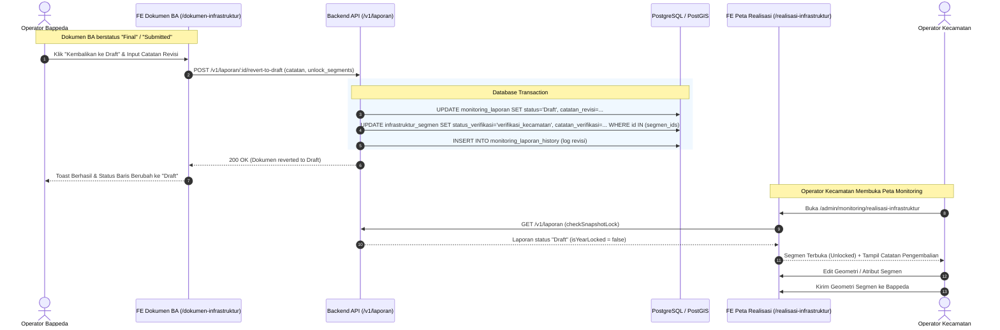

# Spesifikasi Teknis: Fitur Pengembalian Status Laporan ke Draft (Revisi Berita Acara)

Dokumen spesifikasi teknis untuk penyesuaian **Backend (API & Database)** dan **Frontend (UI/UX & State Management)** pada modul **Monitoring Dokumen Infrastruktur** (`/admin/monitoring/dokumen-infrastruktur`) dan **Realisasi Infrastruktur Spasial** (`/admin/monitoring/realisasi-infrastruktur`).

---

## 1. Latar Belakang & Kebutuhan Bisnis

### 1.1 Kondisi Saat Ini (Current State)
- Pada halaman `/admin/monitoring/dokumen-infrastruktur`, dokumen Berita Acara (BA) yang telah dibuat/difinalisasi memiliki status **`Final`**.
- Status `Final` mengunci seluruh segmen realisasi yang terikat dalam tahun anggaran dan desa terkait (`useSnapshotLock`), sehingga segmen tidak dapat diedit atau dihapus.
- Satu-satunya aksi yang tersedia untuk membatalkan BA adalah **Hapus (Delete)**. Namun, aksi hapus ini menghapus record dokumen Berita Acara dan dapat menghapus/melepas relasi segmen secara permanen.

### 1.2 Kebutuhan Fitur Baru (Proposed State)
Diperlukan fitur **"Kembalikan ke Status Draft / Revisi"** (*Revert / Rollback to Draft*):
1. **Preservasi Data**: Tidak menghapus dokumen BA maupun segmen spasialnya.
2. **Status Transisi**: Mengubah status laporan dari `Final` atau `Submitted` kembali menjadi **`Draft`** (atau `Revisi`).
3. **Buka Kunci Segmen Spasial**: Melepas kunci pengeditan (`isYearLocked` & `lockedSegmenIds`) pada segmen-segmen terkait dan mengubah status verifikasi segmen menjadi `dikembalikan` atau `verifikasi_kecamatan`.
4. **Catatan Revisi**: Memungkinkan Operator Bappeda memberikan catatan revisi terpusat yang dapat dibaca langsung oleh Operator Kecamatan pada panel peta monitoring.
5. **Alur Kerja Siklus**: Operator Kecamatan dapat memperbaiki/menambah segmen, lalu mengirimkan ulang ke Bappeda untuk diverifikasi dan difinalisasi kembali tanpa kehilangan nomor dokumen BA yang sudah diplot.

---

## 2. Diagram Alur Kerja (Workflow Diagram)



---

## 3. Penyesuaian Backend (API & Database)

### 3.1 Perubahan Skema Database PostgreSQL

#### A. Enum `status_verifikasi` pada Tabel `infrastruktur_segmen`
Field `status_verifikasi` pada tabel `infrastruktur_segmen` secara konsisten terdiri dari **3 nilai enum resmi**:
1. **`verifikasi_kecamatan`**: Segmen berada di tingkat kecamatan (Draft baru atau Segmen yang Dikembalikan/Revisi oleh Bappeda).
2. **`verifikasi_bappeda`**: Segmen telah dikirim oleh Operator Kecamatan dan sedang menunggu verifikasi Bappeda.
3. **`terverifikasi`**: Segmen telah disetujui / diverifikasi oleh Operator Bappeda.

> **Penting**: Ketika segmen dikembalikan / di-revert untuk perbaikan, nilainya diubah menjadi **`verifikasi_kecamatan`** disertai pengisian kolom **`catatan_verifikasi`** (atau `catatan_revisi`).

```sql
-- Pastikan check constraint status_verifikasi pada infrastruktur_segmen
ALTER TABLE infrastruktur_segmen 
DROP CONSTRAINT IF EXISTS chk_infrastruktur_segmen_status_verifikasi;

ALTER TABLE infrastruktur_segmen 
ADD CONSTRAINT chk_infrastruktur_segmen_status_verifikasi 
CHECK (status_verifikasi IN ('verifikasi_kecamatan', 'verifikasi_bappeda', 'terverifikasi'));
```

#### B. Penambahan Kolom pada Tabel `monitoring_laporan`
```sql
-- 1. Tambah kolom catatan revisi dan metadata pengembalian
ALTER TABLE monitoring_laporan 
ADD COLUMN IF NOT EXISTS catatan_revisi TEXT,
ADD COLUMN IF NOT EXISTS reverted_at TIMESTAMPTZ,
ADD COLUMN IF NOT EXISTS reverted_by UUID REFERENCES users(id),
ADD COLUMN IF NOT EXISTS history_revisi JSONB DEFAULT '[]'::jsonb;

-- 2. Pastikan check constraint status mendukung 'Draft' dan 'Revisi'
ALTER TABLE monitoring_laporan 
DROP CONSTRAINT IF EXISTS chk_monitoring_laporan_status;

ALTER TABLE monitoring_laporan 
ADD CONSTRAINT chk_monitoring_laporan_status 
CHECK (status IN ('Draft', 'Submitted', 'Final', 'Revisi', 'Dibatalkan'));
```

#### C. Struktur Data `history_revisi` (JSONB)
Setiap kali laporan dikembalikan ke Draft, backend menambahkan objek ke array `history_revisi`:
```json
[
  {
    "reverted_at": "2026-08-15T13:30:00Z",
    "reverted_by_id": "9b1deb4d-3b7d-4bad-9bdd-2b0d7b3dcb6d",
    "reverted_by_name": "Ahmad Fauzi (Operator Bappeda)",
    "previous_status": "Final",
    "catatan": "Segmen RW 03 belum menyambung dengan ruas poros utama. Mohon digitasi ulang sambungan.",
    "affected_segments_count": 8
  }
]
```

---

### 3.2 Spesifikasi Endpoint REST API

#### 🌟 1. Revert Laporan ke Draft
- **Endpoint**: `POST /v1/laporan/:id/revert-to-draft`
- **Method**: `POST`
- **Auth**: Bearer JWT (Role: `operator_bappeda`, `super_admin`, `admin`)
- **URL Params**: `id` (UUID Dokumen Laporan)

**Request Body**:
```json
{
  "catatan": "Perbaiki sambungan persimpangan pada segmen RT 04 sebelum difinalisasi.",
  "unlock_segments": true,
  "target_segment_status": "verifikasi_kecamatan"
}
```

| Field | Tipe | Wajib | Default | Keterangan |
|---|---|:---:|---|---|
| `catatan` | `string` | Ya | `""` | Alasan / arahan revisi untuk operator kecamatan |
| `unlock_segments` | `boolean` | Tidak | `true` | Apakah status verifikasi segmen ikut diubah |
| `target_segment_status` | `string` | Tidak | `"verifikasi_kecamatan"` | Nilai enum: `"verifikasi_kecamatan"` |

**Response Sukses (200 OK)**:
```json
{
  "status": "success",
  "message": "Dokumen Berita Acara berhasil dikembalikan ke status Draft untuk revisi.",
  "result": {
    "id": "c7a8e2b1-5d9f-4e3a-8b1a-1e2f3a4b5c6d",
    "nomor_ba": "050/012/412.302/2026",
    "id_desa": "3524010001",
    "tahun_anggaran": 2026,
    "status": "Draft",
    "catatan_revisi": "Perbaiki sambungan persimpangan pada segmen RT 04 sebelum difinalisasi.",
    "reverted_at": "2026-08-15T13:35:00.000Z",
    "updated_at": "2026-08-15T13:35:00.000Z",
    "unlocked_segments_count": 5
  }
}
```

**Logika Pemrosesan Backend (ACID Transaction)**:
```typescript
// Pseudocode Handler di Hapi.js / Express
async function revertToDraftHandler(request, h) {
  const { id } = request.params;
  const { catatan, unlock_segments = true, target_segment_status = 'verifikasi_kecamatan' } = request.payload;
  const currentUser = request.auth.credentials;

  return await db.transaction(async (trx) => {
    // 1. Ambil data laporan
    const laporan = await trx('monitoring_laporan').where({ id }).first();
    if (!laporan) {
      return h.response({ status: 'error', message: 'Laporan tidak ditemukan' }).code(404);
    }

    // 2. Ambil segmen yang terkait dengan laporan
    const relasiSegmens = await trx('monitoring_laporan_segmen').where({ laporan_id: id });
    const segmenIds = relasiSegmens.map(r => r.segmen_id);

    // 3. Update status segmen spasial ke verifikasi_kecamatan jika unlock_segments == true
    let updatedSegmentsCount = 0;
    if (unlock_segments && segmenIds.length > 0) {
      updatedSegmentsCount = await trx('infrastruktur_segmen')
        .whereIn('id', segmenIds)
        .update({
          status_verifikasi: 'verifikasi_kecamatan',
          catatan_verifikasi: catatan,
          updated_at: new Date()
        });
    }

    // 4. Buat histori log revisi
    const historyItem = {
      reverted_at: new Date().toISOString(),
      reverted_by_id: currentUser.id,
      reverted_by_name: currentUser.nama || currentUser.username,
      previous_status: laporan.status,
      catatan: catatan,
      affected_segments_count: updatedSegmentsCount
    };

    const existingHistory = Array.isArray(laporan.history_revisi) ? laporan.history_revisi : [];
    const updatedHistory = [...existingHistory, historyItem];

    // 5. Update status laporan menjadi Draft
    const [updatedLaporan] = await trx('monitoring_laporan')
      .where({ id })
      .update({
        status: 'Draft',
        catatan_revisi: catatan,
        reverted_at: new Date(),
        reverted_by: currentUser.id,
        history_revisi: JSON.stringify(updatedHistory),
        updated_at: new Date()
      })
      .returning('*');

    return h.response({
      status: 'success',
      message: 'Dokumen Berita Acara berhasil dikembalikan ke status Draft untuk revisi.',
      result: {
        ...updatedLaporan,
        unlocked_segments_count: updatedSegmentsCount
      }
    }).code(200);
  });
}
```

---

#### 🌟 2. Penyesuaian Endpoint `GET /v1/laporan` dan `GET /v1/laporan/:id`
Pastikan query SELECT pada backend menyertakan kolom baru ke dalam serializer JSON response:
- `catatan_revisi` (String/Null)
- `reverted_at` (ISO Timestamp/Null)
- `reverted_by` (UUID/Null)
- `history_revisi` (Array Object)
- Mendukung filter query parameter `?status=Draft`, `?status=Submitted`, `?status=Final`.

---

#### 🌟 3. Update Endpoint `DELETE /v1/laporan/:id` (Safe Delete)
Tambahkan opsi parameter query `?delete_segments=false` agar penghapusan dokumen BA tidak secara otomatis menghapus segmen fisik, melainkan hanya menghapus dokumen dan melepaskan segmen kembali ke status belum terikat (`verifikasi_kecamatan`).

---

## 4. Penyesuaian Frontend (ReactJS / Vite)

### 4.1 Service Layer (`monitoring_laporan.service.ts`)
Tambahkan method `revertToDraft`:

```typescript
// app/features/monitoring/services/monitoring_laporan.service.ts

export interface RevertToDraftPayload {
    catatan?: string;
    unlock_segments?: boolean;
    target_segment_status?: 'dikembalikan' | 'verifikasi_kecamatan';
}

export const monitoringLaporanService = {
    // ... method existing ...

    revertToDraft: async (id: string, payload?: RevertToDraftPayload): Promise<any> => {
        return await apiClient.post(
            `${import.meta.env.VITE_API_BASE_URL}/v1/laporan/${id}/revert-to-draft`,
            payload || {},
            { showErrorToast: true }
        );
    }
};
```

---

### 4.2 Halaman Dokumen Infrastruktur (`app/routes/monitoring/dokumen-infrastruktur/index.tsx`)

#### A. State Baru untuk Modal Revert to Draft
```tsx
const [revertDialogOpen, setRevertDialogOpen] = useState(false);
const [selectedLaporanToRevert, setSelectedLaporanToRevert] = useState<any>(null);
const [catatanRevisiInput, setCatatanRevisiInput] = useState("");
const [isSubmittingRevert, setIsSubmittingRevert] = useState(false);
```

#### B. Tombol Aksi "Kembalikan ke Draft" pada Tabel
Ditambahkan di samping tombol **Detail (`Eye`)** dan **Hapus (`Trash2`)**:

```tsx
{/* Tombol Revert ke Draft (Hanya untuk Bappeda/Admin pada status Final/Submitted) */}
{user?.role !== 'operator_kecamatan' && (lap.status === 'Final' || lap.status === 'Submitted') && (
    <Button
        variant="outline"
        size="sm"
        className="h-7 w-7 p-0 border-amber-200 dark:border-amber-800 text-amber-600 hover:text-amber-700 hover:bg-amber-50 dark:hover:bg-amber-950/30 shrink-0"
        onClick={(e) => {
            e.stopPropagation();
            setSelectedLaporanToRevert(lap);
            setCatatanRevisiInput("");
            setRevertDialogOpen(true);
        }}
        title="Kembalikan Status ke Draft (Buka Kunci untuk Revisi)"
    >
        <RotateCcw className="h-3.5 w-3.5" />
    </Button>
)}
```

#### C. Dialog Konfirmasi Revert to Draft
```tsx
<Dialog open={revertDialogOpen} onOpenChange={setRevertDialogOpen}>
    <DialogContent className="sm:max-w-md bg-background border-border rounded-2xl shadow-2xl p-0 overflow-hidden">
        <DialogHeader className="px-6 py-4 border-b border-border/80 bg-amber-500/10 dark:bg-amber-950/20">
            <div className="flex items-center gap-3">
                <div className="w-10 h-10 rounded-full bg-amber-500/20 text-amber-600 dark:text-amber-400 flex items-center justify-center shrink-0">
                    <RotateCcw className="w-5 h-5" />
                </div>
                <div>
                    <DialogTitle className="text-base font-bold text-foreground">
                        Kembalikan Dokumen ke Draft
                    </DialogTitle>
                    <DialogDescription className="text-xs text-muted-foreground mt-0.5">
                        Membuka kunci pengeditan segmen agar operator kecamatan dapat melakukan revisi
                    </DialogDescription>
                </div>
            </div>
        </DialogHeader>

        <div className="p-6 space-y-4 text-xs">
            {selectedLaporanToRevert && (
                <div className="p-3.5 rounded-xl bg-amber-50 dark:bg-amber-950/30 border border-amber-200 dark:border-amber-800/60 text-amber-900 dark:text-amber-200 space-y-1.5">
                    <p className="font-bold text-xs">Informasi Dokumen BA:</p>
                    <div className="grid grid-cols-2 gap-1 text-[11px]">
                        <div>No. BA: <strong className="font-mono">{selectedLaporanToRevert.nomor_ba}</strong></div>
                        <div>TA: <strong className="font-mono">{selectedLaporanToRevert.tahun_anggaran}</strong></div>
                        <div className="col-span-2">Wilayah: <strong>{selectedLaporanToRevert.Desa?.nama_desa} ({selectedLaporanToRevert.Kecamatan?.nama_kecamatan})</strong></div>
                    </div>
                </div>
            )}

            <div className="space-y-1.5">
                <Label htmlFor="catatanRevisi" className="text-xs font-bold">
                    Catatan Revisi untuk Kecamatan <span className="text-rose-500">*</span>
                </Label>
                <textarea
                    id="catatanRevisi"
                    rows={3}
                    value={catatanRevisiInput}
                    onChange={(e) => setCatatanRevisiInput(e.target.value)}
                    placeholder="Contoh: Perbaiki geometri segmen ruas RT 02 dan sesuaikan tipe perkerasan..."
                    className="w-full text-xs p-2.5 rounded-lg border border-input bg-background focus:ring-2 focus:ring-amber-500 focus:outline-hidden"
                />
            </div>
        </div>

        <DialogFooter className="px-6 py-4 border-t border-border/80 bg-muted/20 flex flex-row gap-2 justify-end">
            <Button
                type="button"
                variant="outline"
                onClick={() => setRevertDialogOpen(false)}
                disabled={isSubmittingRevert}
                className="h-9 px-4 text-xs font-semibold rounded-xl"
            >
                Batal
            </Button>
            <Button
                type="button"
                onClick={async () => {
                    if (!selectedLaporanToRevert) return;
                    setIsSubmittingRevert(true);
                    const toastId = toast.loading("Mengembalikan status dokumen ke Draft...");
                    try {
                        await monitoringLaporanService.revertToDraft(selectedLaporanToRevert.id, {
                            catatan: catatanRevisiInput.trim(),
                            unlock_segments: true
                        });
                        toast.success("Dokumen berhasil dikembalikan ke status Draft. Kunci segmen telah dibuka untuk revisi kecamatan.", { id: toastId });
                        setRevertDialogOpen(false);
                        await fetchLaporan();
                    } catch (err: any) {
                        toast.error(err?.message || "Gagal mengembalikan status dokumen", { id: toastId });
                    } finally {
                        setIsSubmittingRevert(false);
                    }
                }}
                disabled={isSubmittingRevert}
                className="h-9 px-5 text-xs font-bold rounded-xl bg-amber-600 hover:bg-amber-700 text-white shadow-md shadow-amber-500/20 gap-1.5"
            >
                {isSubmittingRevert ? <Loader2 className="w-3.5 h-3.5 animate-spin" /> : <RotateCcw className="w-3.5 h-3.5" />}
                <span>Konfirmasi Buka Revisi</span>
            </Button>
        </DialogFooter>
    </DialogContent>
</Dialog>
```

---

### 4.3 Integrasi Otomatis pada Peta Monitoring (`app/routes/monitoring/realisasi-infrastruktur/`)

1. **`useSnapshotLock.ts`**:
   - Fungsi `checkSnapshotLock()` hanya mendeteksi laporan dengan `status === 'Final'`.
   - Ketika laporan diubah menjadi `Draft`, filter `lap.status === 'Final'` bernilai `false`, sehingga `isYearLocked = false` dan `lockedSegmenIds = empty`.
   - Hasil: Seluruh segmen pada desa dan tahun anggaran tersebut langsung otomatis terbuka dari kunci (*unlocked*).

2. **Panel Kartu Segmen (`InfrastrukturPanel.tsx`)**:
   - Status verifikasi segmen yang berubah menjadi `verifikasi_kecamatan` akan menampilkan kotak notifikasi merah/amber berisi **Catatan Pengembalian dari Bappeda** (`r.catatan_verifikasi`).
   - Tombol **Edit Geometri (`PinIcon`)**, **Edit Atribut (`FileEdit`)**, **Split Segmen (`Scissors`)**, dan **Hapus (`Trash2`)** kembali aktif untuk Operator Kecamatan.

---

## 5. Rencana Pengujian (Verification & Test Matrix)

| Skenario Uji | Tindakan | Hasil yang Diharapkan |
|---|---|---|
| **1. Pengembalian BA Final** | Operator Bappeda klik "Kembalikan ke Draft" pada BA status Final dan memasukkan catatan. | Status dokumen berubah menjadi `Draft`, histori revisi tercatat di database, toast sukses muncul. |
| **2. Buka Kunci Segmen Spasial** | Buka halaman `/admin/monitoring/realisasi-infrastruktur` untuk desa & tahun yang baru di-revert. | Badge "BA FINAL / DIKUNCI" hilang, tombol Edit Atribut & Geometri aktif kembali. |
| **3. Tampilan Catatan Revisi** | Periksa kartu segmen pada panel samping realisasi infrastruktur. | Banner catatan pengembalian dari Bappeda tampil jelas dengan instruksi perbaikan. |
| **4. Revisi & Re-Submit** | Operator Kecamatan mengubah geometri/atribut segmen lalu klik "Kirim Bappeda". | Segmen berhasil dikirim ulang dengan status `verifikasi_bappeda`. |
| **5. Finalisasi Ulang** | Operator Bappeda mencetak/membuat BA baru. | Dokumen kembali berstatus `Final` dan segmen kembali terkunci (*immutable snapshot*). |
| **6. Hak Akses (RBAC)** | Login sebagai `operator_kecamatan` pada halaman `/admin/monitoring/dokumen-infrastruktur`. | Tombol "Kembalikan ke Draft" dan "Hapus" tidak muncul (hanya mode lihat dan cetak). |

---

## 6. Ringkasan File yang Terpengaruh

| Komponen | Path File | Jenis Perubahan |
|---|---|---|
| **Dokumentasi** | `docs/SPEC_REVISI_DRAFT_DOKUMEN_INFRASTRUKTUR.md` | `[NEW]` Spesifikasi Lengkap |
| **Frontend Service** | `app/features/monitoring/services/monitoring_laporan.service.ts` | `[MODIFY]` Tambah method `revertToDraft` |
| **Frontend Page** | `app/routes/monitoring/dokumen-infrastruktur/index.tsx` | `[MODIFY]` Tambah tombol aksi & Dialog Revert to Draft |
| **Backend Route** | `routes/v1/laporan.js` (Repository Backend) | `[NEW/MODIFY]` Endpoint `POST /:id/revert-to-draft` |
| **Backend Controller** | `controllers/laporanController.js` (Repository Backend) | `[NEW/MODIFY]` Logika Transaksi Revert Status & Segmen |
| **Backend Migration** | `migrations/add_catatan_revisi_to_laporan.sql` (Repository Backend) | `[NEW]` Penambahan kolom database |
