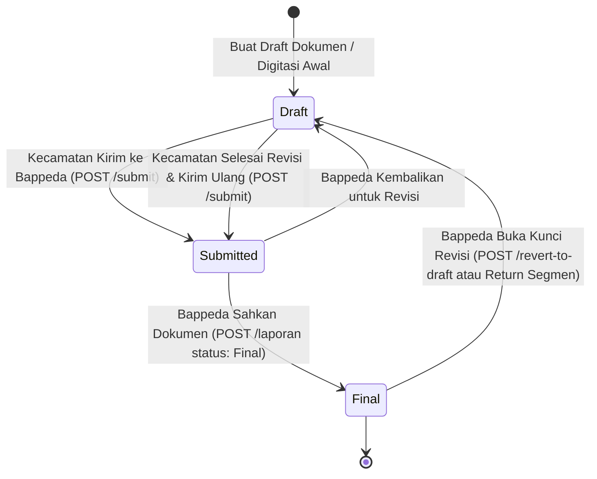

# 📄 Panduan Integrasi Backend untuk Tim Frontend: Alur Siklus Hidup Dokumen Berita Acara & Revisi Segmen

Dokumen ini berisi panduan teknis dan spesifikasi endpoint untuk **Tim Frontend** terkait alur **Revisi Dokumen Berita Acara**, **Pengembalian Segmen ke Kecamatan**, **Pengiriman Ulang (Submission) oleh Kecamatan**, dan **Snapshot Ulang (Re-Snapshot / Upsert)**.

---

## 🔄 1. Diagram Alur Siklus Hidup (Status Lifecycle)



---

## 🔒 2. Matriks Hak Akses & Transisi Status (RBAC Matrix)

| Role | Draft ➔ Submitted | Submitted ➔ Final | Final ➔ Draft (Revert) | Scope Wilayah |
|---|:---:|:---:|:---:|:---:|
| `operator_kecamatan` | ✅ **DIIZINKAN** | ❌ **DILARANG (403)** | ❌ **DILARANG (403)** | Terbatas pada `id_kecamatan` user |
| `operator_bappeda`   | ✅ Diizinkan     | ✅ Diizinkan          | ✅ Diizinkan          | Seluruh Kabupaten |
| `super_admin` / `admin` | ✅ Diizinkan  | ✅ Diizinkan          | ✅ Diizinkan          | Seluruh Kabupaten |

---

## 🚀 3. Rincian Endpoint & Cara Penggunaan

### A. Pengembalian Dokumen Berita Acara ke Draft (Buka Kunci Revisi)
Digunakan ketika Operator Bappeda ingin mengembalikan seluruh Berita Acara ke status Draft agar Operator Kecamatan dapat mengedit/menghapus/menambah segmen spasial.

- **Method**: `POST` atau `PATCH`
- **Endpoint**: `/v1/laporan/:id/revert-to-draft`
- **Role**: `operator_bappeda`, `super_admin`, `admin`
- **Request Body**:
```json
{
  "catatan": "Perbaiki trase jalan pada STA 0+200 dan perjelas sambungan persimpangan.",
  "unlock_segments": true,
  "target_segment_status": "verifikasi_kecamatan"
}
```
- **Efek Backend**:
  - `monitoring_laporan.status` $\rightarrow$ `'Draft'`.
  - `infrastruktur_segmen.status_verifikasi` $\rightarrow$ `'verifikasi_kecamatan'`.
  - `infrastruktur_segmen.catatan_verifikasi` terisi dengan catatan yang dikirimkan.
  - Catatan revisi tersimpan pada `catatan_revisi` dan riwayat tercatat di array `history_revisi`.

---

### B. Pengembalian Segmen Individual oleh Bappeda
Digunakan ketika Bappeda hanya ingin mengembalikan satu segmen tertentu dari tabel/peta untuk diperbaiki kecamatan.

- **Method**: `PATCH`
- **Endpoint**: `/v1/infrastruktur/:tipe/segmen/:segmenId/verifikasi`
- **Role**: `operator_bappeda`, `super_admin`, `admin`
- **Request Body**:
```json
{
  "status_verifikasi": "verifikasi_kecamatan",
  "catatan_verifikasi": "Panjang fisik jalan tidak sesuai dengan dokumen lapangan."
}
```
- **Efek Backend**:
  - `infrastruktur_segmen.status_verifikasi` $\rightarrow$ `'verifikasi_kecamatan'`.
  - **Auto-Revert Dokumen**: Jika dokumen terkait berstatus `'Final'`, backend **otomatis me-revert** dokumen tersebut ke `'Draft'` dan mencatat audit log di `history_revisi`.
  - **Auto-Sync Catatan**: Kolom `catatan_verifikasi` otomatis disinkronkan ke `monitoring_laporan.catatan_revisi`.

---

### C. Pengiriman Hasil Digitasi / Revisi oleh Kecamatan ke Bappeda
Digunakan setelah Operator Kecamatan selesai melakukan digitasi awal atau menyelesaikan revisi segmen.

- **Method**: `POST` atau `PATCH`
- **Endpoint Khusus**: `/v1/laporan/:id/submit`
- **Endpoint Alternatif**: `PATCH /v1/laporan/:id` dengan payload `{ "status": "Submitted" }`
- **Role**: `operator_kecamatan`, `operator_bappeda`, `super_admin`, `admin`
- **Aturan RBAC**:
  - Operator Kecamatan hanya dapat mengirimkan dokumen di wilayah kecamatannya (`id_kecamatan` cocok).
  - Operator Kecamatan ditolak (`403 Forbidden`) jika mencoba mengirim `{ "status": "Final" }`.
- **Efek Backend**:
  - `monitoring_laporan.status` $\rightarrow$ `'Submitted'`.
  - `monitoring_laporan.resubmitted_at` $\rightarrow$ Timestamp terkini (`NOW()`).
  - Seluruh segmen terkait otomatis berubah menjadi `status_verifikasi = 'verifikasi_bappeda'`.

---

### D. Snapshot Ulang / Pengesahan Berita Acara (Re-Snapshot / Upsert)
Digunakan ketika Bappeda menekan tombol **"Simpan & Sahkan Berita Acara"** setelah seluruh segmen diperiksa dan disetujui.

- **Method**: `POST` (atau `PATCH /v1/laporan/:id`)
- **Endpoint**: `/v1/laporan`
- **Role**: `operator_bappeda`, `super_admin`, `admin`
- **Request Body**:
```json
{
  "id_desa": 3522012001,
  "id_kecamatan": 352201,
  "tahun_anggaran": 2026,
  "nomor_ba": "050/012/412.302/2026",
  "sumber_dana": "BKK",
  "rencana_panjang": 1500,
  "status": "Final",
  "tipe_kode": "jalan"
}
```
- **Fitur Idempoten & Re-link Otomatis**:
  - **Upsert**: Jika dokumen untuk desa & tahun tersebut sudah ada di database (misal berstatus `Draft` pasca revisi), backend akan langsung meng-update dokumen menjadi `Final` **tanpa error duplikasi**.
  - **Re-link Segmen**: Backend otomatis menghapus link lama dan **mengikat ulang seluruh segmen spasial hasil revisi terbaru** (termasuk segmen yang baru di-split atau baru ditambahkan).
  - **Kalkulasi Realisasi**: Kolom `realisasi_panjang` otomatis dihitung ulang sesuai total panjang segmen hasil revisi.
  - **Audit Trail**: Array `history_revisi` tetap utuh dan tersimpan.

---

### E. Sinkronisasi Target & Realisasi Fisik
Jika frontend ingin menyinkronkan ulang rencana target dari Plotting Anggaran dan mengikat seluruh segmen spasial aktif terbaru:

- **Method**: `PATCH`
- **Endpoint**: `/v1/laporan/:id/sync-target`
- **Role**: `operator_bappeda`, `super_admin`, `admin`
- **Response**: Mengembalikan objek laporan ter-update beserta total rencana panjang dan total realisasi panjang terkini.

---

## 📦 4. Format Respons API (Response Envelope)

Seluruh response dari backend menyediakan properti ganda `data` dan `result` untuk kompatibilitas penuh dengan frontend:

```json
{
  "status": "success",
  "message": "Berita Acara Monitoring berhasil diperbarui dan disahkan (Re-Snapshot).",
  "data": {
    "id": "c7a8e2b1-5d9f-4e3a-8b1a-1e2f3a4b5c6d",
    "nomor_ba": "050/012/412.302/2026",
    "id_desa": 3522012001,
    "id_kecamatan": 352201,
    "tahun_anggaran": 2026,
    "status": "Final",
    "rencana_panjang": 1500.0,
    "realisasi_panjang": 1485.5,
    "catatan_revisi": "Perbaiki trase jalan pada STA 0+200.",
    "history_revisi": [
      {
        "reverted_at": "2026-08-15T12:00:00.000Z",
        "reverted_by_name": "Bappeda Verifikator",
        "previous_status": "Final",
        "catatan": "Perbaiki trase jalan pada STA 0+200.",
        "affected_segments_count": 1
      }
    ],
    "created_at": "2026-08-15T10:00:00.000Z",
    "updated_at": "2026-08-15T14:30:00.000Z"
  },
  "result": {
    "id": "c7a8e2b1-5d9f-4e3a-8b1a-1e2f3a4b5c6d",
    "nomor_ba": "050/012/412.302/2026",
    "id_desa": 3522012001,
    "id_kecamatan": 352201,
    "tahun_anggaran": 2026,
    "status": "Final",
    "rencana_panjang": 1500.0,
    "realisasi_panjang": 1485.5,
    "catatan_revisi": "Perbaiki trase jalan pada STA 0+200.",
    "history_revisi": [ ... ],
    "created_at": "2026-08-15T10:00:00.000Z",
    "updated_at": "2026-08-15T14:30:00.000Z"
  }
}
```
